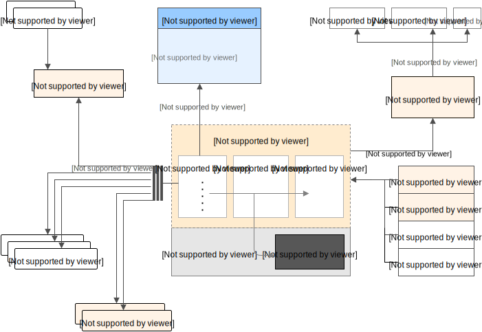

# About
If you are a Ops Team, Developer, Architect or SRE this repo is just for you.
I am maintaining this repo which will talk about different Open Source solution and technology stack towards observability.

5 Factors we will consider while designing tools and technology
1. Open Source
2. Community Support and active development and roadmap
3. Scalable out of box or solution available to scale Observability tools it-self
4. As a Service on Cloud ( Optional )
5. Easy Supports for latest programming languages and Infrastructure

# Stack-1 Observability
1. Prometheus
2. Grafana
3. Alert Manager
4. Jaeger
5. ELK

